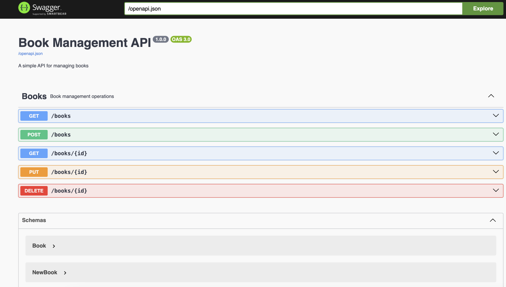
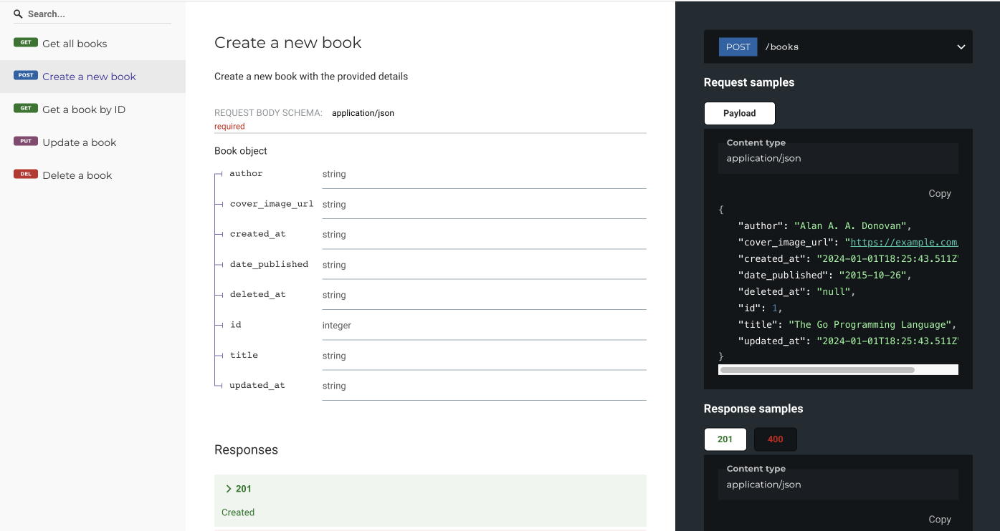

# swift-api-rest-rs
This project implements a simple API just to illustrate how one would go about implementing a REST API using [Actix Web](https://actix.rs/) and [Rust](https://www.rust-lang.org/). 

## Setup

* [Setup for macOS](./docs/setup-macos.md)

## Run

```bash
source configure.sh

cargo run

# or
cargo watch -x check -x run

# or
./watch.sh
```

Browse the docs and test the API via the Swagger UI:

```bash
open http://localhost:8001/docs
```



Browse the docs using Redoc. This is an alternative to the Swagger UI:

```bash
open http://localhost:8001/redoc
```



## Updating the code

Configure project:

```bash
source configure.sh
```

Open the project in Visual Studio Code:

```bash
code .
```

## Development

### Test

Run tests:

```bash
cargo test
```

Generate test coverage report:

```bash
./coverage.sh

# or
cargo tarpaulin --skip-clean --ignore-tests --out Html --output-dir coverage

# open coverage report
open coverage/tarpaulin-report.html
```

### Build

```bash
cargo build
```

### Database Management

Setup DB migrations:

```bash
diesel setup
```

Generate a new DB migration:

```bash
diesel migration generate create_books
```

Apply DB migrations:

```bash
diesel migration run
```

## How to create a new project

```bash
# create new project
cargo init

# add packages
cargo add actix-web dotenv
cargo add diesel --features sqlite,r2d2

cargo add serde --features derive
cargo add serde_json
cargo add chrono --features serde

cargo add utoipa --features actix_extras
cargo add utoipa-swagger-ui --features actix-web

cargo add diesel_migrations
```

Install tools :

```bash
# Diesel CLI
cargo install diesel_cli --no-default-features --features sqlite
# Watch
cargo install cargo-watch
# Test Coverage
cargo install cargo-tarpaulin
```

